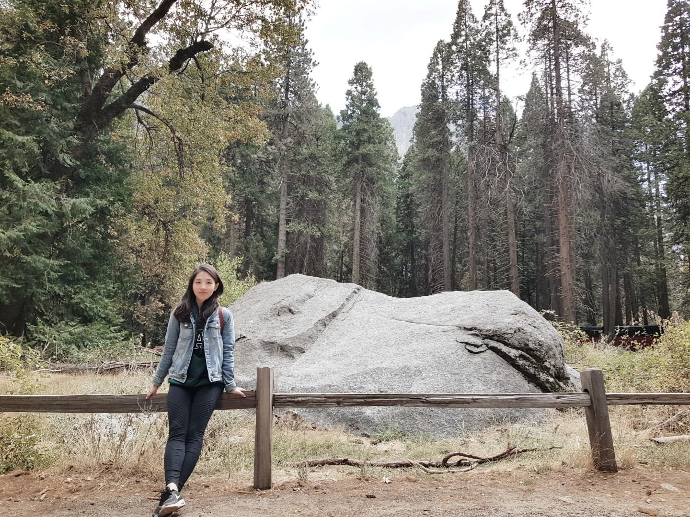

Misun Park is a 2nd year Ph.D student of Computer Science at Georgia Institute of Technology. She has a strong fundamental and enthusiastic insterests on low level system engineering and system software.

## Research Interest

My research interests center on distributed systems, virtualization, operating systems, and computer architecture. Through my research, I would like to devise systems which are highly performant, secure, scalable, and fault-tolerant. Currently I am working on exploring the opportunities in the mobile edge infrastructure.

## Publications

1. Lightweight Containers for the Edge. Misun Park, Ketan Bhardwaj, Ada Gavrilovska, *TECHCON 2020*, Sep. 2020 (In Press)
2. Toward Lighter Containers for the Edge. Misun Park, Ketan Bhardwaj, Ada Gavrilovska, *USENIX Workshop on Hot Topics in Edge Computing (HotEdge'20)*, Jun. 2020

## Education

## Work Experience

## Skills

## Personal Interests

## References

## Typography

This is a [link](http://google.com). Something *italics* and something **bold**.

Here is a table

Year | Award | Category
-----|-------|--------
2014 | Emmy  | Won Outstanding Lead Actor in a miniseries or a movie
2015 | BAFTA | Nominated for Best Leading Actor for Sherlock
2014 | Satellite | Won Best Actor miniseries or television film

Here is a horizontal rule

---

Here is a blockquote

> To a great mind, nothing is little

## References

* Foo Bar: Head of Department, Placeholder Names, Lorem
* John Doe: Associate Professor, Department of Computer Science, Ipsum
